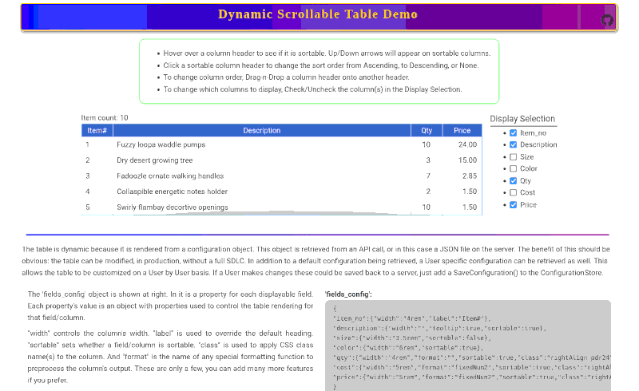

# Dynamic Scrollable Table



Data tables are common in applications. Many are populated with data from API calls. And like many applications, the requirements change over time. Whether it's the changing data schema or changing User requirements, this demo shows a technique for easily accommodating these changes.

> Have a look at the [**LIVE DEMO**](http://www.hovind.com/demos/dynamic-scrollable-table)

This dynamic table is rendered from a configuration object and a corresponding array. These two objects can be retrieved from an API call or a downloaded JSON file. So the application can be updated without the need for a rebuild. Or even modified in real-time as the demo shows.<br />


An example configuration object looks like this:
```json
{
  "item_no":{"width":"4rem","label":"Item#"},
  "description":{"width":"","tooltip":true,"sortable":true},
  "size":{"width":"3.5rem","sortable":false},
  "color":{"width":"6rem","sortable":true},
  "qty":{"width":"4rem","format":"","sortable":true,"class":"rightAlign pdr24"},
  "cost":{"width":"5rem","format":"fixedNum2","sortable":true,"class":"rightAlign pdr10"},
  "price":{"width":"5rem","format":"fixedNum2","sortable":true,"class":"rightAlign pdr10"}
}
```

This object has a property for every __potential__ field/column in the table. Each field then has properties to specify the width and/or style, as well as any other special processing you prefer. As you can see in the code, it's easy to add any custom features. (See the demo for a further explanation of this object in action.)<br />

An additional configuration property/variable is an array specifying what fields to show, and it what order. Manipulating this array makes it easy to change the table layout. All without having to edit code. It can even be done by a User if permitted.<br />

The configuration object, along with the display array allow the table to be rendered dynamically, and without a full SDLC. It also can allow configuration on a User by User basis. Since it's a technique and not a library package, you should be able to apply this to many existing UI frameworks or plugins. This demo was done in Vue.js and leveraged Vue's reactivity, but it can be done in any framework, or no framework, just by rerendering the DOM after the configuration objects change.

<br /><br />

## Project Setup

```sh
npm install
```

### Compile and Hot-Reload for Development

```sh
npm run dev
```

### Compile and Minify for Production

```sh
npm run build
```

